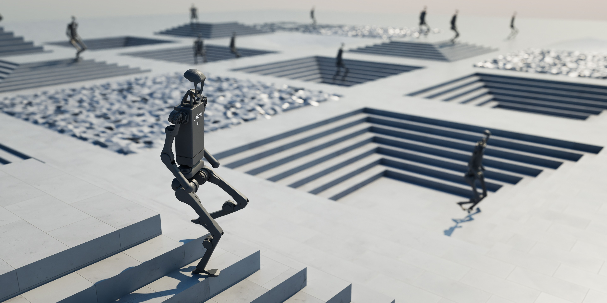

<div align="center">

# FB-MEBE: Maximum Entropy Behavior Exploration

[Website](https://math-286-pro.github.io/FB-MEBE-Web/)&emsp;&emsp;[Paper](https://arxiv.org/abs/2603.25464)

Code for the paper [`"Maximum Entropy Behavior Exploration for Sim2Real Zero-Shot Reinforcement Learning"`](https://arxiv.org/abs/2603.25464).


</div>


## File Structure

```
scripts/
└── reinforcement_learning/
    └── fb_mod/
        ├── agent_meta/
        │   └── fb/
        │       └── agent.py (code related to FB agent)
        ├── configs/ (folder related to FB agent and training settings)
        ├── density_estimator/ (folder related to normalizing flow)
        └── pretrain.py (code of FB training)
```

## Configuration
```yaml
# We use hydra to configure all the parameters

# this file stores all the FB agent hyperparameter settings
scripts/reinforcement_learning/fb_mod/configs/agent/FBAgent.yaml

# this file will inherit the "FBAgent.yaml" and override its hyperparameter
scripts/reinforcement_learning/fb_mod/configs/Isaaclab_pretrain_config_base.yaml

# In Go2 Tasks we use Isaaclab_pretrain_config_go2.yaml
# It inherits the Isaaclab_pretrain_config_base.yaml and override its task type
scripts/reinforcement_learning/fb_mod/configs/Isaaclab_pretrain_config_go2.yaml


# Details of Isaaclab_pretrain_config_go2.yaml. 
# These are the most frequently change parameters

env: 
 device:      simulate on which device
 video_train: record pretrain or not
 video_eval:  record evaluation or not 
              (if you enable this you also have to enable video_train,
               otherwise will report error)
 num_envs:    number of parallel environment you will run
 task:        select relevent tasks

 # there are three types of task now (we commented two out)

# 1. "Isaac-Flat-Unitree-Go2-Rnd-Full-FB-ABS-v0" 
# has random friction and robot base, link mass, and use absolute joint control

# 2. "Isaac-Flat-Unitree-Go2-Rnd-Full-FB-INC-v0" 
# same as above but use incremental/delta control (can be viewed as joint velocity control). This is to expend the action space.

# 3. "Isaac-Flat-Unitree-Go2-Rnd-Full-FB-ABS-KAIST-v0" 
# absolute joint control, and added (sin(t), cos(t)) two more observation and use soft-barrier-function from KAIST (remember to set agent.model.archi.critic=True to use this task)

wandb:
  use_wandb: upload data to wandb
  entity:    your wandb account entity
  project:   desired target project
  name:      desired target name
  group:     desired target group

agent:
 compile: by setting to True will make training faster
 train: 
   lr_f: learning rate for forward network
   lr_b: learning rate for backward network
   lr_actor: learning rate for actor network
 model:
   archi: architecture for different networks
     critic:
       enable: if you want to enable critic or not
```

## Training
```bash
# 0. clone this repo
git clone https://github.com/MATH-286-Pro/FB-MEBE.git

# 1. create virtual env (conda example)
conda create -n env_fb python=3.10 -y
conda activate env_fb

# 2. install isaacsim 
# (you can follow: https://isaac-sim.github.io/IsaacLab/main/source/setup/installation/pip_installation.html)
pip install --upgrade pip
pip install "isaacsim[all,extscache]==4.5.0" --extra-index-url https://pypi.nvidia.com
# NOTE: This command is for x86_64 system
pip install -U torch==2.7.0 torchvision==0.22.0 --index-url https://download.pytorch.org/whl/cu128


# 3. install isaaclab
./isaaclab.sh --install

# 4. Monitor training using wandb
# first run this command to log in to your wandb account
pip install --upgrade wandb
wandb login
# then go to "scripts/reinforcement_learning/fb_mod/configs/Isaaclab_pretrain_config_go2.yaml"
# in wandb section change to your "entity" and "project"

# 5. Run bash to train FB (you might encounter some python dependency issues)
./bash/fb_pretrain.sh

```
```bash
# Other commands and notes
./bash/fb_pretrain_multi.sh # For series of training
./bash/play_xbox.sh         # run model in isaaclab controlled by joystick
./euler/server.md           # check the procedure to run training on Euler

```

## Issues
```bash
```

## Q&A

> Q1: The trained FB model exhibits YAW drift during forward locomotion. Can this issue be mitigated by incorporating mirrored data during pretraining like [D3](https://leggedrobotics.github.io/d3-skill-discovery/)?
> 
> A1: In our experiments, training with mirrored data did not successfully eliminate the drift.

<!-- 

---

# Isaac Lab

[](https://docs.isaacsim.omniverse.nvidia.com/latest/index.html)
[](https://docs.python.org/3/whatsnew/3.10.html)
[](https://releases.ubuntu.com/20.04/)
[](https://www.microsoft.com/en-us/)
[](https://github.com/isaac-sim/IsaacLab/actions/workflows/pre-commit.yaml)
[](https://github.com/isaac-sim/IsaacLab/actions/workflows/docs.yaml)
[](https://opensource.org/licenses/BSD-3-Clause)
[](https://opensource.org/license/apache-2-0)


**Isaac Lab** is a GPU-accelerated, open-source framework designed to unify and simplify robotics research workflows, such as reinforcement learning, imitation learning, and motion planning. Built on [NVIDIA Isaac Sim](https://docs.isaacsim.omniverse.nvidia.com/latest/index.html), it combines fast and accurate physics and sensor simulation, making it an ideal choice for sim-to-real transfer in robotics.

Isaac Lab provides developers with a range of essential features for accurate sensor simulation, such as RTX-based cameras, LIDAR, or contact sensors. The framework's GPU acceleration enables users to run complex simulations and computations faster, which is key for iterative processes like reinforcement learning and data-intensive tasks. Moreover, Isaac Lab can run locally or be distributed across the cloud, offering flexibility for large-scale deployments.

## Key Features

Isaac Lab offers a comprehensive set of tools and environments designed to facilitate robot learning:
- **Robots**: A diverse collection of robots, from manipulators, quadrupeds, to humanoids, with 16 commonly available models.
- **Environments**: Ready-to-train implementations of more than 30 environments, which can be trained with popular reinforcement learning frameworks such as RSL RL, SKRL, RL Games, or Stable Baselines. We also support multi-agent reinforcement learning.
- **Physics**: Rigid bodies, articulated systems, deformable objects
- **Sensors**: RGB/depth/segmentation cameras, camera annotations, IMU, contact sensors, ray casters.


## Getting Started

Our [documentation page](https://isaac-sim.github.io/IsaacLab) provides everything you need to get started, including detailed tutorials and step-by-step guides. Follow these links to learn more about:

- [Installation steps](https://isaac-sim.github.io/IsaacLab/main/source/setup/installation/index.html#local-installation)
- [Reinforcement learning](https://isaac-sim.github.io/IsaacLab/main/source/overview/reinforcement-learning/rl_existing_scripts.html)
- [Tutorials](https://isaac-sim.github.io/IsaacLab/main/source/tutorials/index.html)
- [Available environments](https://isaac-sim.github.io/IsaacLab/main/source/overview/environments.html)


## Contributing to Isaac Lab

We wholeheartedly welcome contributions from the community to make this framework mature and useful for everyone.
These may happen as bug reports, feature requests, or code contributions. For details, please check our
[contribution guidelines](https://isaac-sim.github.io/IsaacLab/main/source/refs/contributing.html).

## Show & Tell: Share Your Inspiration

We encourage you to utilize our [Show & Tell](https://github.com/isaac-sim/IsaacLab/discussions/categories/show-and-tell) area in the
`Discussions` section of this repository. This space is designed for you to:

* Share the tutorials you've created
* Showcase your learning content
* Present exciting projects you've developed

By sharing your work, you'll inspire others and contribute to the collective knowledge
of our community. Your contributions can spark new ideas and collaborations, fostering
innovation in robotics and simulation.

## Troubleshooting

Please see the [troubleshooting](https://isaac-sim.github.io/IsaacLab/main/source/refs/troubleshooting.html) section for
common fixes or [submit an issue](https://github.com/isaac-sim/IsaacLab/issues).

For issues related to Isaac Sim, we recommend checking its [documentation](https://docs.omniverse.nvidia.com/app_isaacsim/app_isaacsim/overview.html)
or opening a question on its [forums](https://forums.developer.nvidia.com/c/agx-autonomous-machines/isaac/67).

## Support

* Please use GitHub [Discussions](https://github.com/isaac-sim/IsaacLab/discussions) for discussing ideas, asking questions, and requests for new features.
* Github [Issues](https://github.com/isaac-sim/IsaacLab/issues) should only be used to track executable pieces of work with a definite scope and a clear deliverable. These can be fixing bugs, documentation issues, new features, or general updates.

## Connect with the NVIDIA Omniverse Community

Have a project or resource you'd like to share more widely? We'd love to hear from you! Reach out to the
NVIDIA Omniverse Community team at OmniverseCommunity@nvidia.com to discuss potential opportunities
for broader dissemination of your work.

Join us in building a vibrant, collaborative ecosystem where creativity and technology intersect. Your
contributions can make a significant impact on the Isaac Lab community and beyond!

## License

The Isaac Lab framework is released under [BSD-3 License](LICENSE). The `isaaclab_mimic` extension and its corresponding standalone scripts are released under [Apache 2.0](LICENSE-mimic). The license files of its dependencies and assets are present in the [`docs/licenses`](docs/licenses) directory.

## Acknowledgement

Isaac Lab development initiated from the [Orbit](https://isaac-orbit.github.io/) framework. We would appreciate if you would cite it in academic publications as well:

```
@article{mittal2023orbit,
   author={Mittal, Mayank and Yu, Calvin and Yu, Qinxi and Liu, Jingzhou and Rudin, Nikita and Hoeller, David and Yuan, Jia Lin and Singh, Ritvik and Guo, Yunrong and Mazhar, Hammad and Mandlekar, Ajay and Babich, Buck and State, Gavriel and Hutter, Marco and Garg, Animesh},
   journal={IEEE Robotics and Automation Letters},
   title={Orbit: A Unified Simulation Framework for Interactive Robot Learning Environments},
   year={2023},
   volume={8},
   number={6},
   pages={3740-3747},
   doi={10.1109/LRA.2023.3270034}
}
``` -->
