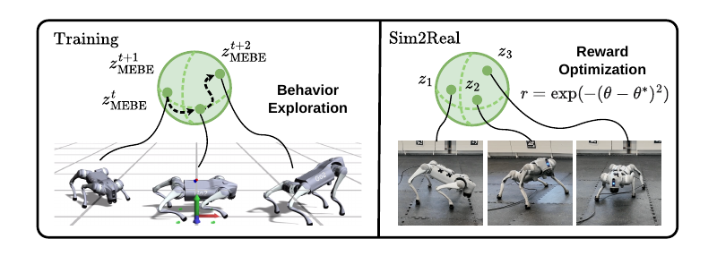

<div align="center">

# FB-MEBE: Maximum Entropy Behavior Exploration

[Website](https://math-286-pro.github.io/FB-MEBE-Web/)&emsp;&emsp;[Paper](https://arxiv.org/abs/2603.25464)

Code for the paper [`"Maximum Entropy Behavior Exploration for Sim2Real Zero-Shot Reinforcement Learning"`](https://arxiv.org/abs/2603.25464).


</div>

This fork and branch is a minimal cleaning of the original repo and an additional (WIP) tutorial.

## File Structure

```
scripts/
└── reinforcement_learning/
    └── fb_mod/
        ├── agent_meta/
        │   └── fb/
        │       └── agent.py (code related to FB agent)
        ├── configs/ (folder related to FB agent and training settings)
        ├── density_estimator/ (folder related to normalizing flow)
        └── pretrain.py (code of FB training)
```

## Configuration
```yaml
# We use hydra to configure all the parameters

# this file stores all the FB agent hyperparameter settings
scripts/reinforcement_learning/fb_mod/configs/agent/FBAgent.yaml

# this file will inherit the "FBAgent.yaml" and override its hyperparameter
scripts/reinforcement_learning/fb_mod/configs/Isaaclab_pretrain_config_base.yaml

# In Go2 Tasks we use Isaaclab_pretrain_config_go2.yaml
# It inherits the Isaaclab_pretrain_config_base.yaml and override its task type
scripts/reinforcement_learning/fb_mod/configs/Isaaclab_pretrain_config_go2.yaml


# Details of Isaaclab_pretrain_config_go2.yaml. 
# These are the most frequently change parameters

env: 
 device:      simulate on which device
 video_train: record pretrain or not
 video_eval:  record evaluation or not 
              (if you enable this you also have to enable video_train,
               otherwise will report error)
 num_envs:    number of parallel environment you will run
 task:        select relevent tasks

 # there are three types of task now (we commented two out)

# 1. "Isaac-Flat-Unitree-Go2-Rnd-Full-FB-ABS-v0" 
# has random friction and robot base, link mass, and use absolute joint control

# 2. "Isaac-Flat-Unitree-Go2-Rnd-Full-FB-INC-v0" 
# same as above but use incremental/delta control (can be viewed as joint velocity control). This is to expend the action space.

# 3. "Isaac-Flat-Unitree-Go2-Rnd-Full-FB-ABS-KAIST-v0" 
# absolute joint control, and added (sin(t), cos(t)) two more observation and use soft-barrier-function from KAIST (remember to set agent.model.archi.critic=True to use this task)

wandb:
  use_wandb: upload data to wandb
  entity:    your wandb account entity
  project:   desired target project
  name:      desired target name
  group:     desired target group

agent:
 compile: by setting to True will make training faster
 train: 
   lr_f: learning rate for forward network
   lr_b: learning rate for backward network
   lr_actor: learning rate for actor network
 model:
   archi: architecture for different networks
     critic:
       enable: if you want to enable critic or not
```

## Training
```bash
# 0. clone this repo
git clone https://github.com/MATH-286-Pro/FB-MEBE.git

# 1. create virtual env (conda example)
conda create -n fb-mebe python=3.10 -y
conda activate fb-mebe

# 2. install isaacsim
# (you can follow: https://isaac-sim.github.io/IsaacLab/main/source/setup/installation/pip_installation.html)
pip install --upgrade pip
pip install "isaacsim[all,extscache]==4.5.0" --extra-index-url https://pypi.nvidia.com
# NOTE: This command is for x86_64 system
pip install -U torch==2.7.0+cu128 torchvision==0.22.0+cu128 --index-url https://download.pytorch.org/whl/cu128


# 3. install isaaclab
./isaaclab.sh --install
# Reinstall torch after Isaac Lab install (needed for RTX 50xx / sm_120):
pip install -U torch==2.7.0+cu128 torchvision==0.22.0+cu128 torchaudio==2.7.0+cu128 --index-url https://download.pytorch.org/whl/cu128
# If Hydra is missing, install the Facebook Hydra package:
pip install hydra-core
# Do not install the unrelated package named "hydra".

# 4. Monitor training using wandb
# wandb is disabled by default. To enable it, first run this command to log in:
wandb login
# then go to "scripts/reinforcement_learning/fb_mod/configs/Isaaclab_pretrain_config_go2.yaml"
# in wandb section set use_wandb=true and change "entity" and "project" to a workspace you can access.
# If wandb 0.12.x crashes online, this FB script does not use rl-games; use:
pip uninstall rl-games
pip install "wandb==0.17.9" "protobuf<5,>=3.20.3"

# 5. Run bash to train FB (you might encounter some python dependency issues)
./bash/fb_pretrain.sh

```
```bash
# Other commands and notes
./bash/fb_pretrain_multi.sh # For series of training
./bash/play_xbox.sh         # run model in isaaclab controlled by joystick
./euler/server.md           # check the procedure to run training on Euler

```

## Issues
```bash
```

## Q&A

> Q1: The trained FB model exhibits YAW drift during forward locomotion. Can this issue be mitigated by incorporating mirrored data during pretraining like [D3](https://leggedrobotics.github.io/d3-skill-discovery/)?
> 
> A1: In our experiments, training with mirrored data did not successfully eliminate the drift.
